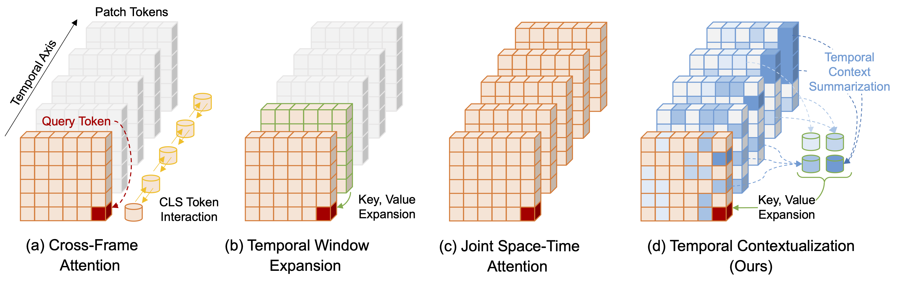

## Leveraging Temporal Contextualization for Video Action Recognition

> [ECCV 2024] [**Leveraging Temporal Contextualization for Video Action Recognition**](https://arxiv.org/abs/2404.09490) \
> [Minji Kim&dagger;](https://byminji.github.io), [Dongyoon Han](https://sites.google.com/site/dyhan0920/), [Taekyung Kim*](https://scholar.google.co.kr/citations?user=u-9bdkwAAAAJ&hl=en), [Bohyung Han*](https://cv.snu.ac.kr/index.php/~bhhan/) <br>
<sub> (&dagger;Work done during an internship at NAVER AI Lab, *corresponding authors) <br>
> [NAVER AI LAB](https://naver-career.gitbook.io/en/teams/clova-cic/ai-lab)

[](https://arxiv.org/abs/2404.09490)
[](https://drive.google.com/drive/folders/1dKkzYsCCk2_hcXTcHH1ZwmyQMiLFNWqo)
[](https://paperswithcode.com/paper/leveraging-temporal-contextualization-for)

Official PyTorch implementation of the ECCV 2024 paper "**Leveraging Temporal Contextualization for Video Action Recognition**"


<br>



### Abstract
> We propose a novel framework for video understanding, called Tempoally Contextualized CLIP (TC-CLIP), 
> which leverages essential temporal information through global interactions in a spatio-temporal domain within a video. 
> To be specific, we introduce Temporal Contextualization (TC), a layer-wise temporal information infusion mechanism for videos, 
> which 1) extracts core information from each frame, 2) connects relevant information across frames for the summarization into 
> context tokens, and 3) leverages the context tokens for feature encoding. 
> Furthermore, the Video-conditional Prompting (VP) module processes context tokens to generate informative prompts in the text modality. 
> Extensive experiments in zero-shot, few-shot, base-to-novel, and fully-supervised action recognition validate the effectiveness of our model. 
> Ablation studies for TC and VP support our design choices.


### Updates
* (2024/07/24): Code and pretrained models are released.
* (2024/07/02): TC-CLIP is accepted at ECCV 2024! 🎉


## :rocket: Highlights

### :exclamation: Motivation: insufficient token interactions in recent temporal modeling approaches


> Prior works consider temporal cues during the encoding process via **(a) Cross-Frame Attention** with CLS token interactions or
> **(b) Temporal Window Expansion** by adding adjacent frame tokens to key-value pairs.
> However, the former lacks patch-level details, while the latter limits the range of temporal interactions.
> **(c) Joint Space-Time Attention** allows full interactions across all tokens, but exhibits weak discriminability due to sparse attention on the backgrounds, witnessing extrapolation challenges
> (See details in the paper.)
> **(d) Temporal Contextualization (Ours)** aggregates pivotal tokens from a broader range into key-value pairs, successfully focusing on informative regions across all frames.


### :sparkles: Temporally Contextualized CLIP (TC-CLIP)
: A novel video understanding framework that leverages holistic video information within its encoding process.
1. **Temporal Contextualization (TC)**: Unlike prior approaches that access only a limited amount of tokens, TC allows global interactions by 
summarizing informative tokens from the entire video into _context tokens_ and leveraging them during the feature encoding process.
2. **Video-conditional Prompting (VP)**: Based on the summarized context tokens from the visual domain, VP generates instance-level textual prompts that compensate for the lack of textual semantics in action recognition datasets.
3. **Solid performance**: TC-CLIP achieves stat-of-the-art performance across zero-shot, few-shot, base-to-novel, fully-supervised settings on five video action recognition benchmarks.


## :file_folder: Models
We use CLIP ViT-B/16 for all experiments below. All the checkpoints can be downloaded at this [link](https://drive.google.com/drive/folders/1dKkzYsCCk2_hcXTcHH1ZwmyQMiLFNWqo).
* (LLM) denotes that the models are using LLM-rephrased category names from [FROSTER](https://github.com/Visual-AI/FROSTER). Note that experiments on the SSv2 dataset do not involve LLM-rephrasing. 
* (P) denotes that the models are first pretrained on Kinetics-400 and subsequently fine-tuned on each dataset. Otherwise, models are directly fine-tuned from CLIP. See Appendix A in the paper.

#### Zero-shot action recognition

| Scripts                                                                 |   HMDB-51    |   UCF-101    |  Kinetics-600  |                                      Ckpt                                       |
|-------------------------------------------------------------------------|:------------:|:------------:|:--------------:|:--------------------------------------------------------------------------------:|
| [TC-CLIP](scripts/train/zero_shot/train_tc_clip_zero_shot.sh)           |  54.2 ± 0.7  |  82.9 ± 0.6  |   75.8 ± 0.5   | [Link](https://drive.google.com/drive/folders/1gAB3LtNzVerkVerifgJFRL0WciPvrAlR) |
| [TC-CLIP (LLM)](scripts/train/zero_shot/train_tc_clip_zero_shot_llm.sh) |  56.0 ± 0.3  |  85.4 ± 0.8  |   78.1 ± 1.0   | [Link](https://drive.google.com/drive/folders/18CWhh4MZ9EvGlJeCHpW48mEfjMTLMCSk) |


#### Few-shot action recognition

| Scripts                                                                    |          HMDB-51          |          UCF-101          |           SSv2           |  Ckpt  |
|----------------------------------------------------------------------------|:-------------------------:|:-------------------------:|:------------------------:|:-------------:|
|                                                                            |  K=2 / K=4 / K=8 / K=16   |  K=2 / K=4 / K=8 / K=16   |  K=2 / K=4 / K=8 / K=16  | |
| [TC-CLIP](scripts/train/few_shot/train_tc_clip_few_shot.sh)                | 57.3 / 62.3 / 67.3 / 68.6 | 85.9 / 89.9 / 92.5 / 94.6 |  7.3 / 8.6 / 9.3 / 14.0  |   [Link](https://drive.google.com/drive/folders/1kKSpRTQa6h2zR6uVnM8DeudnJawGuWUE)    |
| [TC-CLIP (LLM)](scripts/train/few_shot/train_tc_clip_few_shot_llm.sh)      | 58.6 / 63.3 / 65.5 / 68.8 | 86.8 / 90.1 / 92.0 / 94.3 |  7.3 / 8.6 / 9.3 / 14.0  |   [Link](https://drive.google.com/drive/folders/1G2G9IOCxlJlmjEmg6rM0trvoOIfPhi8g)    |
| [TC-CLIP (P)](scripts/train/few_shot/train_tc_clip_few_shot_pretrained.sh) | 65.3 / 68.5 / 71.4 / 73.0 | 94.1 / 95.6 / 96.6 / 97.3 | 8.7 / 10.1 / 12.1 / 15.2 |   [Link](https://drive.google.com/drive/folders/1WFrjiI6hcTX6cgRAnuwlBqfpSPXV4L43)    |

#### Base-to-novel generalization

| Scripts                                                                    |       K-400        |      HMDB-51       |      UCF-101       |        SSv2        |                                       Ckpt                                       |
|----------------------------------------------------------------------------|:------------------:|:------------------:|:------------------:|:------------------:|:--------------------------------------------------------------------------------:|
|                                                                            | Base / Novel / HM  | Base / Novel / HM  | Base / Novel / HM  | Base / Novel / HM  |                                                                                  |
| [TC-CLIP](scripts/train/few_shot/train_tc_clip_few_shot.sh)                | 78.9 / 63.6 / 70.4 | 73.3 / 54.1 / 62.2 | 95.5 / 78.0 / 85.9 | 17.5 / 13.4 / 15.2 | [Link](https://drive.google.com/drive/folders/1NWdC4EpUyR99b0OquPNGudKqrHo9S8OR) |
| [TC-CLIP (LLM)](scripts/train/few_shot/train_tc_clip_few_shot_llm.sh)      | 79.1 / 65.4 / 71.6 | 73.3 / 59.1 / 65.5 | 95.4 / 81.6 / 88.0 | 17.5 / 13.4 / 15.2 | [Link](https://drive.google.com/drive/folders/19mEhCdzyp8Y-Ox1R1_yQPt6yUGGzJtlX) |
| [TC-CLIP (P)](scripts/train/few_shot/train_tc_clip_few_shot_pretrained.sh) |        N/A         | 79.4 / 58.3 / 67.2 | 97.5 / 84.5 / 90.5 | 19.6 / 15.6 / 17.4 | [Link](https://drive.google.com/drive/folders/11jUZ4E1joynG26hAuzMpq8b3J9NbEHjw) |


#### Fully-supervised action recognition

| Scripts                                                                     | K-400 (Top-1) | K-400 (Top-5) |                                       Ckpt                                       |
|-----------------------------------------------------------------------------|:-------------:|:-------------:|:--------------------------------------------------------------------------------:|
| [TC-CLIP](scripts/train/fully_supervised/train_tc_clip_fully_supervised.sh) |     85.2      |     96.9      | [Link](https://drive.google.com/drive/folders/1yBrynFBqvdSnOXuY8arKWSOT5-pxdj8M) |


## :hammer: Environments

### Installation
Please follow the instructions in [INSTALL.md](docs/INSTALL.md).

### Data preparation
Please follow the instructions in [DATASETS.md](docs/DATASETS.md) for data preparation.

### Configuration
The organization of configurations in this project is outlined in [CONFIG.md](docs/CONFIG.md).


## :dizzy: Training and Evaluation

The basic usage of the commands for training and evaluation is outlined below.
For detailed instructions on all experimental setup, please refer to [TRAIN_EVAL.md](docs/TRAIN_EVAL.md).

### Training for TC-CLIP
For all experiments in our main paper, we provide example training commands in [scripts/train](scripts/train) folder.
The basic usage of the training command is as follows:
```bash
# Basic usage:
torchrun --nproc_per_node=4 main.py -cn ${protocol} \
data=${protocol}_${dataset_name} output=${your_ckpt_saving_path} trainer=${trainer_name}

# Example:
torchrun --nproc_per_node=4 main.py -cn zero_shot \
data=zero_shot_k400 output=ckpt/zero_shot_k400_tc_clip trainer=tc_clip
```
**Note**:
- Note that there is no `--` as in Python's native argparse.
- Here, `${protocol}` refers to the chosen protocol (e.g., zero_shot, few_shot), `${dataset_name}` refers to the specific dataset under the chosen protocol, 
`${your_ckpt_saving_path}` is the path where checkpoints will be saved, and `${trainer_name}` is the name of the model.
- `main_testing` function is called at the end of the training to evaluate the accuracy with the best checkpoint.


### Evaluation for TC-CLIP
We provide example evaluation commands in [scripts/eval](scripts/eval) folder.
The basic usage of the evaluation command is as follows:
```bash
# Basic usage:
torchrun --nproc_per_node=4 main.py -cn ${protocol} \
data=${protocol}_${dataset_name} output=${your_result_saving_path} \
trainer=${trainer_name} eval=test resume=${ckpt_path}

# Example:
torchrun --nproc_per_node=4 main.py -cn zero_shot \
data=zero_shot_k400 output=/PATH/TO/OUTPUT \
trainer=tc_clip eval=test resume=ckpt/zero_shot_k400_tc_clip/best.pth
```
**Note**:
- Set `eval=test` or `eval=val` for evaluation-only mode.
- Specify the checkpoint path in `resume=${ckpt_path}`.


## :telephone: Contact
If you have any questions, please create an issue on this repository or contact at taekyung.k@navercorp.com and minji@snu.ac.kr.

## :thumbsup: Acknowledgements
This project is built upon [ViFi-CLIP](https://github.com/muzairkhattak/ViFi-CLIP) and borrowed features from [FROSTER](https://github.com/Visual-AI/FROSTER) and [ToMe](https://github.com/facebookresearch/ToMe).
We sincerely thank the authors for these greate codebases.

## :lock: License
```
TC-CLIP
Copyright (c) 2024-present NAVER Cloud Corp.
CC BY-NC 4.0 (https://creativecommons.org/licenses/by-nc/4.0/)
```

## :pushpin: Citation
If you find TC-CLIP useful in your research, please consider citing our paper:
```
@article{kim2024tcclip,
  title={Leveraging Temporal Contextualization for Video Action Recognition},
  author={Kim, Minji and Han, Dongyoon and Kim, Taekyung and Han, Bohyung},
  journal={European Conference on Computer Vision (ECCV)},
  year={2024}
}
```  
